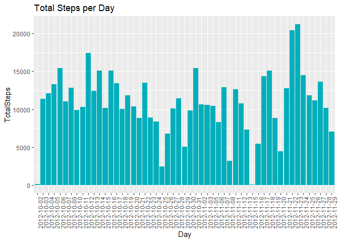
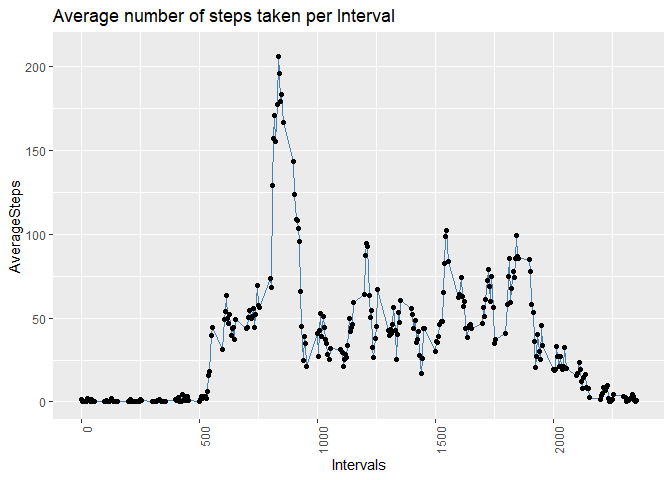
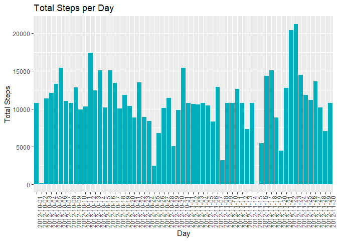

1 - Code for reading in the dataset and/or processing the data:
===============================================================

First we download and save the data:

```r
setwd("C:/Users/igorp/Documents/Courses/DataScience Course - Coursera/05 - Reproducible Research/Week 2 - Project 1")
URL <- "https://d396qusza40orc.cloudfront.net/repdata%2Fdata%2Factivity.zip"
downloadFile <- "repdata_data_activity.zip"
activityFile <- "repdata_data_activity.csv"

if (!file.exists(activityFile)) {
    download.file(URL, downloadFile, method = "curl")
    unzip(downloadFile, overwrite = TRUE, exdir = "C:/Users/igorp/Documents/Courses/DataScience Course - Coursera/05 - Reproducible Research/Week 2 - Project 1")
}
```

Reading and saving data into a data frame:

```r
ActivityData <- read.csv(file = "activity.csv", header = TRUE, sep = ",")
```

2 - Histogram of the total number of steps taken each day:
==========================================================

Here I used the aggregate function to create a data frame with the total steps per day:

```r
StepsPerDay <- aggregate(steps ~ date, ActivityData, sum)
```

Now with the ggplot2 library, we create the histogram:

```r
library(ggplot2)
colnames(StepsPerDay) <- c("Date","TotalSteps")
ggplot(StepsPerDay, aes(x = Date, y = TotalSteps)) +
        geom_histogram(stat = "identity", fill = "#00AFBB") +
        ggtitle("Total Steps per Day") +
        xlab("Day") +
        theme(axis.text.x = element_text(angle = 90, hjust = 1))
```

```
## Warning: Ignoring unknown parameters: binwidth, bins, pad
```

<!-- -->

3 - Mean and median number of steps taken each day:
===================================================

Calculating the mean of the total number of steps taken per day:

```r
TotalStepsDay_mean <- mean(StepsPerDay$TotalSteps)
TotalStepsDay_mean
```

```
## [1] 10766.19
```

The mean of total number of steps taken per day is: 10766.19.


Calculating the median of the total number of steps taken per day:

```r
TotalStepsDay_median <- median(StepsPerDay$TotalSteps)
TotalStepsDay_median
```

```
## [1] 10765
```

The median of total number of steps taken per day is: 10765.

4 - Time series plot of the average number of steps taken:
==========================================================

Here I used the aggregate function to create a data frame with the average steps per day: 

```r
StepsPerInterval_Average <- aggregate(steps ~ interval, ActivityData, mean)
colnames(StepsPerInterval_Average) <- c("Interval","AverageSteps")
```

Ploting the time series graph with ggplot2:

```r
h <- ggplot(StepsPerInterval_Average, mapping = aes(x = Interval, y = AverageSteps))
h +     geom_line(color = "steelblue") +
        geom_point(stroke = 0.5) +
        xlab("Intervals") +
        ggtitle("Average number of steps taken per Interval") +
        theme(axis.text.x = element_text(angle = 90, hjust = 1)) +
        ylim(0,210)
```

<!-- -->

5 - The 5-minute interval that, on average, contains the maximum number of steps:
=================================================================================


```r
MaxStepsInterval <- StepsPerInterval_Average$Interval[max(StepsPerInterval_Average$AverageSteps)]
MaxStepsInterval
```

```
## [1] 1705
```

The 5-minute interval that, on average, contains the maximum number of steps is :
1705

6 - Code to describe and show a strategy for imputing missing data:
===================================================================


```r
countNA <- sum(is.na(ActivityData$steps))
countNA
```

```
## [1] 2304
```

There is a total of 2304 NA values in the data.

Now we're going to fill all the missing values in the data set with the mean for that 5-minute interval.

```r
CleanActivityData = ActivityData
for(i in 1:length(ActivityData$steps)) {
        if (is.na(ActivityData$steps[i])){
                CleanActivityData$steps[i] <- StepsPerInterval_Average$AverageSteps[StepsPerInterval_Average$Interval == ActivityData$interval[i]]
        }
}

CleanActivityData$steps <- as.numeric(format(CleanActivityData$steps, digits = 2))
```

As we can see above, the values for steps that once was NA, now are filled with the average value for that interval.

```r
head(CleanActivityData)
```

```
##   steps       date interval
## 1 1.717 2012-10-01        0
## 2 0.340 2012-10-01        5
## 3 0.132 2012-10-01       10
## 4 0.151 2012-10-01       15
## 5 0.075 2012-10-01       20
## 6 2.094 2012-10-01       25
```

7 - Histogram of the total number of steps taken each day after missing values are imputed:
===============================================================================

First I used the aggregate function to sum the total steps that was taken in each day:

```r
CleanStepsPerDay_Sum <- aggregate(steps ~ date, CleanActivityData, sum)
```

Ploting the histogram with ggplot2:

```r
library(ggplot2)
ggplot(CleanStepsPerDay_Sum, aes(x = date, y = steps)) +
        geom_histogram(stat = "identity", fill = "#00AFBB") +
        ggtitle("Total Steps per Day") +
        xlab("Day") +
        ylab("Total Steps") +
        theme(axis.text.x = element_text(angle = 90, hjust = 1))
```

```
## Warning: Ignoring unknown parameters: binwidth, bins, pad
```

<!-- -->

8 - Panel plot comparing the average number of steps taken per 5-minute interval across weekdays and weekends
================================================================================

In ordert to get the weekdays in english we need to set the Sys.setlocale:

```r
Sys.setlocale("LC_TIME", "C")
```

```
## [1] "C"
```

Transforming the class of the field date from factor to the date format.

```r
CleanActivityData$date <- as.Date(CleanActivityData$date, format = "%Y-%m-%d")
```

Creating a new column witch indicates if the day is a weekday or a weekend day.

```r
ActivityWeekday <- weekdays(CleanActivityData$date)
weekday <- c("Monday","Tuesday","Wednesday","Thursday","Friday")
for (i in 1:length(CleanActivityData$date)){
        if(ActivityWeekday[i] %in% weekday){
                ActivityWeekday[i] <- "weekday"
        }
        else{
              ActivityWeekday[i] <- "weekend"  
        }
}
```

Merging the weekday column in the CleanActivityData data frame.

```r
ActivityWeekDay <- cbind(CleanActivityData, ActivityWeekday)
head(ActivityWeekDay)
```

```
##   steps       date interval ActivityWeekday
## 1 1.717 2012-10-01        0         weekday
## 2 0.340 2012-10-01        5         weekday
## 3 0.132 2012-10-01       10         weekday
## 4 0.151 2012-10-01       15         weekday
## 5 0.075 2012-10-01       20         weekday
## 6 2.094 2012-10-01       25         weekday
```

Here we can see a table indicating the total days in our data that are weekdays or weekend days.

```r
table(ActivityWeekday)
```

```
## ActivityWeekday
## weekday weekend 
##   12960    4608
```


```r
StepsPerIntervalPerWeekday_Average <- aggregate(steps ~ interval + ActivityWeekday, ActivityWeekDay, mean)

require(lattice)
```

```
## Loading required package: lattice
```

```r
with(StepsPerIntervalPerWeekday_Average, 
     xyplot(steps ~ interval | ActivityWeekday, type = "l", 
            xlab = "Interval", ylab = "Number of Steps", layout = c(1,2)))
```

<!-- -->
